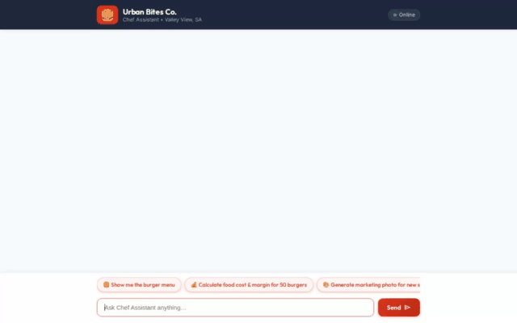

# Urban Bites Co. Chef Assistant AI Agent

A specialized AI assistant designed for **Urban Bites Co.** (a gourmet burger restaurant based in Valley View, South Australia). Built using Google's Agent Development Kit (ADK), the agent provides interactive menu lookups, recipe margin and profitability calculations, AI-powered food photography and video clip generation, local places discovery, and structured UI rendering.



---

## Capabilities & Implemented Tools

The agent is powered by `gemini-2.5-flash` for multi-step reasoning and orchestrates the following implemented tools in `app/tools.py`:

- **Firestore Menu Management**:
  - `get_menu_items`: Queries the `menu_items` collection in Google Cloud Firestore (`qwiklabs-gcp-01-7a15d6c92f07`) to fetch current gourmet burger items, descriptions, and prices.
  - `add_menu_item`: Adds new menu items directly to the Firestore `menu_items` database collection.

- **Recipe Profitability & Margin Calculator**:
  - `calculate_recipe_margins`: Calculates cost per unit, total revenue, gross profit, and profit margin percentages for recipe costing and batch orders.

- **AI Food Photography Generation**:
  - `generate_item_image`: Generates high-quality food photography using Google's `gemini-3.1-flash-lite-image` model in the `global` Vertex AI region. Saves the generated image as a Playground Artifact (`tool_context.save_artifact`) and uploads it to Google Cloud Storage (`urban-bites-co-media-qwiklabs-gcp-01-7a15d6c92f07`), returning a public HTTPS URL.
  - `generate_marketing_image`: Generates social media promotional photos using Imagen 3 (`imagen-3.0-generate-002`) and stores them in Cloud Storage.

- **AI Food Video Clip Generation**:
  - `generate_item_video`: Generates short video clips for menu items using Google's Omni model (`gemini-omni-flash-preview`) in the `global` Vertex AI region. Saves the video as a Playground Artifact (`tool_context.save_artifact`) and uploads video bytes to Google Cloud Storage.
  - `generate_marketing_video`: Generates promotional social media video clips using Google Veo (`veo-3.1-generate-001`).

- **Live Web Access & Browsing**:
  - `search_web`: Performs real-time Google Web Search queries to retrieve live information, food trends, competitor menus, and market prices.
  - `fetch_website_content`: Fetches, parses, and extracts clean, readable text from any public website URL (e.g. food blogs, competitor sites, supplier portals).

- **Location & Mapping Services**:
  - `geocode_address`: Geocodes addresses using the Google Maps Platform API.
  - `find_nearby_places`: Finds nearby places and competitor locations.

- **Recipe Inspiration & Contextual Utilities**:
  - `search_recipe_inspiration`: Searches culinary ideas and recipe inspiration.
  - `get_weather`: Checks current weather conditions for Valley View and catering events.
  - `get_current_time`: Returns current timestamp and timezone information.

- **Agent Memory & Rich UI**:
  - **Memory Bank**: Persists user context and store preferences across sessions (`PreloadMemoryTool`, `LoadMemoryTool`).
  - **A2UI Rendering**: Uses `a2ui_callback` to generate rich, structured cards and layouts in compatible web clients.

---

## Integrated Google Cloud Services

- **Vertex AI / Gemini Models**: `gemini-2.5-flash` (Reasoning Agent), `gemini-3.1-flash-lite-image` (Food Images), `gemini-omni-flash-preview` (Omni Video), `veo-3.1-generate-001` (Veo Video).
- **Google Cloud Firestore**: Menu database storage (`qwiklabs-gcp-01-7a15d6c92f07`).
- **Google Cloud Storage**: Public media asset bucket (`urban-bites-co-media-qwiklabs-gcp-01-7a15d6c92f07`).
- **Google Maps Platform**: Geocoding and location discovery.
- **Agent Engine / Agent Runtime**: Cloud execution environment for ADK reasoning engines.
- **Google Cloud Run**: Serverless host for the FastAPI proxy backend and web chat frontend.

---

## Project Structure

```
.
├── app/
│   ├── agent.py               # Root ADK agent configuration & tool registrations
│   ├── tools.py               # Implemented tool functions (Firestore, GenAI, GCS, Maps)
│   ├── prompt.py              # System instruction prompts for Urban Bites Co. chef persona
│   └── callbacks.py           # A2UI callbacks for rich UI output rendering
├── frontend/
│   ├── main.py                # FastAPI proxy server for Cloud Run / local execution
│   └── static/
│       └── index.html         # Custom Urban Bites Co. branded web chat UI
├── agents-cli-manifest.yaml   # Manifest for agents-cli build, deployment & publishing
├── demo.gif                   # Looping demonstration recording of the agent UI
└── requirements.txt           # Python dependencies
```

---

## Setup & Local Run Instructions

### Prerequisites
- Python 3.11+
- Google Cloud SDK (`gcloud`) authenticated to your GCP project
- Google Cloud credentials set up (`GOOGLE_APPLICATION_CREDENTIALS` or `gcloud auth application-default login`)

### 1. Install Dependencies
```bash
python -m venv .venv
source .venv/bin/activate
pip install -r requirements.txt
```

### 2. Set Environment Variables
```bash
export GOOGLE_CLOUD_PROJECT="qwiklabs-gcp-01-7a15d6c92f07"
export GOOGLE_MAPS_API_KEY="your-google-maps-api-key"
export AGENT_ENGINE_RESOURCE_NAME="projects/434222316331/locations/us-central1/reasoningEngines/6894869742260060160"
export AGENT_DIRECTORY="app"
```

### 3. Run the Agent Frontend Locally
Navigate to the `frontend/` directory and start the FastAPI proxy server:
```bash
cd frontend
python main.py
```
The application server will start on port `8080`. Open your web browser and navigate to `http://localhost:8080` to interact with the Urban Bites Co. Chef Assistant.

---

## Deployment Instructions

### Deploy Agent Runtime
Deploy or update the agent runtime using `agents-cli`:
```bash
agents-cli scaffold deploy agent_runtime
```

### Deploy Frontend to Cloud Run
Deploy the FastAPI chat UI frontend to Cloud Run:
```bash
gcloud run deploy urban-bites-co-frontend \
  --source ./frontend \
  --region us-central1 \
  --allow-unauthenticated \
  --set-env-vars AGENT_ENGINE_RESOURCE_NAME="projects/434222316331/locations/us-central1/reasoningEngines/6894869742260060160",AGENT_DIRECTORY="app"
```
